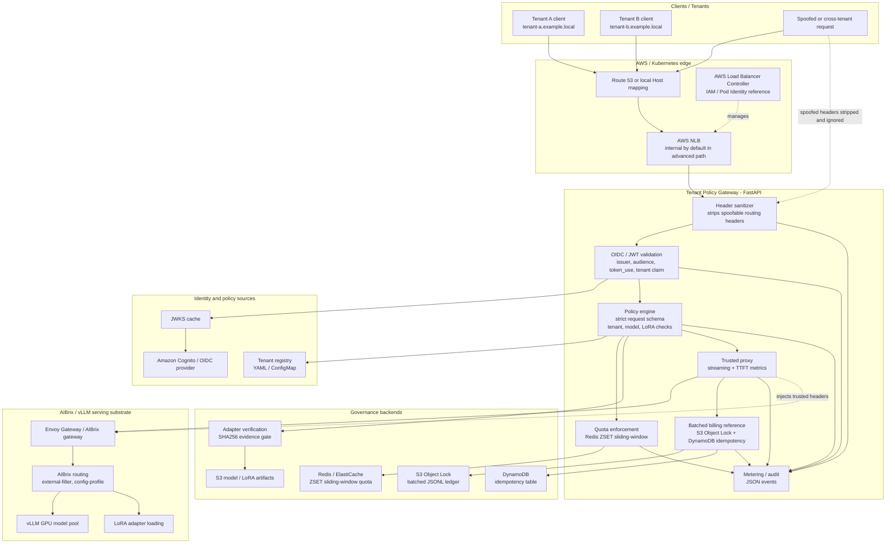

# aibrix-multitenant-llm-gateway

**Audit-hardened AWS/EKS reference lab for tenant-governed LLM serving in front of AIBrix/vLLM.**

This repository shows how to place a SaaS governance layer in front of an LLM serving substrate. It uses a FastAPI **Tenant Policy Gateway** to validate tenant identity, enforce model and LoRA policy, strip spoofable routing headers, inject trusted internal routing metadata, emit audit/metering events, and forward allowed traffic to AIBrix/vLLM.

This is **not** a production-certified SaaS LLM platform. It is a deployable reference lab for engineers who want to understand the hard parts of multi-tenant LLM serving on Kubernetes and AWS EKS.

## PR10 core hardening update

The latest core-hardening pass tightened the runtime internals behind the earlier AWS audit work:

- Redis quota now uses ZSET-based sliding-window Lua scripts instead of fixed buckets.
- Concurrency tracking is request-id based and protected by stale-entry TTL cleanup.
- Token estimation no longer uses the loose `len(text) // 4` fallback. Production-like quota modes must initialize a real tokenizer at startup.
- Incoming request bodies are parsed through strict Pydantic contracts. Unknown/vendor-specific fields are rejected fail-closed.
- Billing ledger writes are memory-bounded and batched before S3/JSONL flushes, with bounded LRU replay protection.

These are production-grade implementation patterns, not a production certification. Live AWS, Redis, S3/DynamoDB, tokenizer artifact, and AIBrix/vLLM load-test evidence are still required before any real SaaS use.

---

## The short version

AIBrix/vLLM is treated as the **serving substrate**, not as the security or SaaS governance boundary.

The gateway sits before AIBrix and handles:

- tenant resolution from the request domain,
- OIDC/JWT validation,
- tenant claim and Host-domain matching,
- allowed model checks,
- allowed LoRA adapter checks,
- spoofed routing-header stripping,
- trusted header injection for AIBrix routing,
- Redis sliding-window quota enforcement reference,
- deterministic tokenizer startup checks for quota estimation,
- strict Pydantic request schema validation,
- audit and metering events,
- batched billing ledger reference hooks,
- streaming proxy with TTFT metrics,
- Kubernetes and AWS EKS deployment examples.

The repository has **three run modes**:

| Path | What it is | Needs GPU? | Uses real AIBrix/vLLM? | Best for |
|---|---|---:|---:|---|
| Local demo | Runs the gateway on your machine with mock auth and mock upstream | No | No | Quick code review and tests |
| Cheap AWS demo | CPU-only EKS deployment with mock auth and mock upstream | No | No | Reviewer-friendly AWS smoke test |
| Advanced GPU full-stack path | Expensive self-managed AWS/EKS lab with GPU, Cognito, AIBrix/vLLM, Redis, S3/DynamoDB references | Yes | Yes | Engineers who explicitly want to test the real infrastructure path |

The Makefile still uses the prefix `aws-danger-*` for the advanced GPU path. **“Danger” is not a product name. It is a warning label.** It means: this path may create expensive AWS resources, requires GPU quota, and is expected to fail unless your AWS account and region are ready for GPU workloads.

---

## Architecture



---

## What problem does this solve?

High-throughput LLM serving stacks such as AIBrix/vLLM are good at model serving, scheduling, routing, and GPU utilization. They are not, by themselves, a complete SaaS governance layer.

This repo demonstrates the layer that usually needs to exist **before** the serving substrate:

```text
Client
  -> AWS/Kubernetes ingress
  -> Tenant Policy Gateway
  -> AIBrix / vLLM serving pool
```

The gateway makes the authorization and routing decision before the request reaches the LLM runtime.

It answers questions such as:

- Which tenant owns this domain?
- Does the JWT claim match the resolved tenant?
- Is this tenant allowed to use this model?
- Is this tenant allowed to use this LoRA adapter with this model?
- Did the client try to spoof internal routing headers?
- What trusted routing headers should AIBrix receive?
- What should be logged for audit, quota, latency, and billing reference?

---

## What this repo is not

This repository is intentionally honest about its limits.

It is **not**:

- a production-certified SaaS LLM platform,
- a complete AWS landing zone,
- a billing-grade inference platform,
- a proof of KV-cache tenant isolation,
- a complete LoRA artifact governance product,
- a managed AIBrix distribution,
- a one-click enterprise deployment.

It is a reference lab that makes the hard production gaps visible and gives you a concrete place to start.

---

## Path 1: Local demo

Use this when you just want to inspect the code and run the policy gateway locally.

```bash
python -m venv .venv
source .venv/bin/activate
pip install -r requirements.txt
make test
make run
```

In another terminal:

```bash
make demo-a
make demo-b
make demo-cross
make demo-lora
make demo-spoof
```

Local demo behavior:

- uses mock auth,
- uses mock upstream,
- does not require AWS,
- does not require AIBrix,
- does not require GPU.

Mock auth accepts tokens such as:

```text
Authorization: Bearer mock:tenant-a:user-123
```

Mock auth is blocked outside local/dev/test/ci unless explicitly overridden for a throwaway demo.

---

## Path 2: Cheap AWS demo

Use this when you want to prove that the gateway can be built, pushed, deployed, exposed, smoke-tested, and destroyed on AWS EKS without GPU.

This path creates:

- a CPU-only EKS cluster,
- an ECR repository,
- a gateway image,
- a Tenant Policy Gateway deployment,
- a public LoadBalancer Service,
- smoke tests using tenant-aware Host headers.

```bash
export AWS_REGION=eu-west-1
export CLUSTER_NAME=aibrix-gateway-demo

make aws-create-cluster
make aws-build-push
make aws-deploy
make aws-smoke
```

Destroy it when done:

```bash
make aws-destroy
```

This path intentionally uses mock auth and mock upstream. It is the recommended path for reviewers because it is cheaper and easier to reproduce.

Read more: [`docs/09-aws-demo-runbook.md`](docs/09-aws-demo-runbook.md)

---

## Path 3: Advanced GPU full-stack path

This is the path previously called **DANGER ZONE** in the repo scripts.

The name exists for a reason: this path may create real AWS costs and can fail if your AWS account is not ready for GPU workloads.

Use this path only if you explicitly want to test the full infrastructure direction:

- GPU-backed EKS node group,
- AWS Load Balancer Controller,
- Cognito OIDC bootstrap,
- S3 model and LoRA artifact buckets,
- Redis / ElastiCache sliding-window quota backend reference,
- S3 Object Lock + DynamoDB batched billing ledger reference,
- Gateway Pod Identity / IAM reference,
- Envoy Gateway,
- AIBrix installation,
- vLLM GPU model deployment,
- Tenant Policy Gateway in OIDC mode,
- adapter verification evidence,
- private-networking evidence checks.

### Before running it

You need:

- AWS CLI configured,
- `eksctl`, `kubectl`, `helm`, `docker`, and `jq`,
- permission to create EKS, IAM, ECR, S3, DynamoDB, Cognito, Load Balancers, and optionally ElastiCache,
- GPU quota in the target AWS region,
- enough budget to pay for GPU/EKS/LB/storage/network resources,
- patience for model download and AIBrix/vLLM startup.

You must explicitly acknowledge the cost/quota risk:

```bash
export I_UNDERSTAND_AWS_GPU_COST_AND_QUOTAS=yes
```

The example env file does **not** set this for you.

### Run sequence

```bash
cp infra/aws/full-stack/full-stack.env.example .aws-danger.env

# Edit this file carefully.
# Set COGNITO_TEST_PASSWORD.
# Review region, GPU instance type, model, network, billing, and quota settings.
vim .aws-danger.env

source .aws-danger.env
export I_UNDERSTAND_AWS_GPU_COST_AND_QUOTAS=yes

make aws-danger-create-gpu-cluster
make aws-danger-oidc
make aws-danger-artifacts
make aws-danger-install-lbc
make aws-danger-install-aibrix
make aws-danger-redis-quota
make aws-danger-billing-ledger
make aws-danger-pod-identity
make aws-danger-verify-adapters
make aws-danger-deploy
make aws-danger-verify-private
make aws-danger-smoke
```

Destroy it when finished:

```bash
make aws-danger-destroy
```

Optional cleanup of persistent resources:

```bash
DELETE_ECR_REPOSITORY=true \
DELETE_COGNITO_USER_POOL=true \
DELETE_ARTIFACT_BUCKETS=true \
make aws-danger-destroy
```

### Why the Makefile target says `aws-danger-*`

The prefix is intentional. It marks the path as high-cost and high-friction.

It does **not** mean the code is reckless. The advanced path includes guardrails:

- consent flag required,
- generated secrets git-ignored,
- Cognito tenant claim created immutable,
- default Cognito password rejected,
- AWS Load Balancer Controller install step,
- Pod Identity / IAM reference step,
- Redis sliding-window quota reference step,
- S3/DynamoDB batched billing reference step,
- adapter verification evidence gate,
- private networking evidence check,
- critical installs fail fast instead of silently continuing.

But it is still an experimental AWS lab, not a production deployment.

Read more:

- [`docs/11-aws-full-stack-danger-zone.md`](docs/11-aws-full-stack-danger-zone.md)
- [`docs/12-danger-zone-production-gaps.md`](docs/12-danger-zone-production-gaps.md)
- [`docs/13-danger-zone-audit-fixes.md`](docs/13-danger-zone-audit-fixes.md)
- [`docs/19-pr9-audit-remediation.md`](docs/19-pr9-audit-remediation.md)
- [`docs/20-pr10-core-hardening.md`](docs/20-pr10-core-hardening.md)

---

## Core security behavior

### Header stripping

The gateway strips client-supplied routing and identity headers before policy evaluation:

```text
x-tenant-id
x-user-id
x-tier
user
external-filter
config-profile
x-internal-tenant-id
x-internal-user-id
x-internal-slo-tier
```

A valid request with spoofed routing headers is not automatically denied. The spoofed values are ignored. The request is allowed only if Host, JWT, tenant, model, adapter, and quota policy still pass.

### Trusted header injection

After an allow decision, the gateway injects trusted downstream headers for AIBrix:

```text
user: tenant-a:user-123
external-filter: tenant=tenant-a
config-profile: gold
x-internal-tenant-id: tenant-a
x-internal-user-id: user-123
```

These values are derived from the tenant registry and validated JWT claims. They are not accepted from public clients.

### Domain-aware tenant routing

Each tenant has one or more domains:

```yaml
tenants:
  - tenant_id: tenant-a
    domains:
      - tenant-a.example.local
```

At request time:

- `Host: tenant-a.example.local` resolves to `tenant-a`,
- the JWT tenant claim must also be `tenant-a`,
- a tenant A token sent to a tenant B domain is denied.

---

## Implemented reference controls

| Area | Implemented reference | Production caveat |
|---|---|---|
| Tenant identity | Host-domain mapping + JWT tenant claim validation | Requires trusted ingress/DNS/proxy boundary |
| OIDC | issuer, audience, token_use, tenant claim, optional scopes/groups, JWKS cache | Not a full enterprise IdP lifecycle |
| Header safety | strips spoofable headers and injects trusted internal headers | Downstream AIBrix must not be directly reachable |
| Request schema | strict Pydantic request contracts, unknown fields rejected | Still only covers the gateway-supported API contract |
| Model policy | tenant model allowlist | Not a model registry product |
| LoRA policy | tenant/model adapter allowlist + catalog metadata | Signature/provenance enforcement is still reference-level |
| Quota | Redis Lua ZSET sliding-window backend with request-id concurrency cleanup | Not a complete global cost-control system or regional quota platform |
| Billing | memory-bounded batching + S3 Object Lock JSONL batches + DynamoDB idempotency reference | Not a full invoice/reconciliation pipeline |
| Streaming | SSE forwarding + TTFT metrics + upstream status propagation | Billing-required modes block streaming unless usage extraction is implemented |
| Audit | structured JSON audit/metering events | Not an immutable SIEM pipeline by itself |
| AWS | EKS scripts, LBC, Pod Identity, NLB verification, private evidence checks | Not a complete landing zone |

---

## Tests

Run:

```bash
make test
```

or:

```bash
PYTHONPATH=src pytest -q
```

The test suite covers:

- valid tenant A and tenant B requests,
- cross-tenant denial,
- forbidden LoRA adapter denial,
- unknown model denial,
- spoofed header stripping,
- missing token denial,
- metering event emission,
- fail-closed tenant registry behavior,
- mock auth safety guardrails,
- quota denial,
- Redis sliding-window source checks,
- strict schema rejection of hidden/vendor adapter fields,
- deterministic tokenizer behavior,
- bounded billing LRU and batched S3 flush behavior,
- adapter governance allow/deny,
- audit sink behavior,
- billing ledger behavior,
- metrics endpoint,
- security posture enforcement,
- streaming billing gate,
- Redis quota behavior,
- AWS demo and advanced-path asset validation.

---

## Repository map

```text
aibrix-multitenant-llm-gateway/
├── config/                         # local tenant registry examples
├── docs/                           # architecture, threat model, audit notes, runbooks
├── examples/                       # curl demos
├── infra/aws/                      # eksctl and AWS env templates
├── k8s/                            # Kubernetes manifests and overlays
├── prompts/                        # coding/eval prompts used for repo evolution
├── scripts/aws/                    # cheap AWS demo scripts
├── scripts/aws-danger/             # advanced GPU full-stack scripts
├── src/tenant_policy_gateway/      # FastAPI gateway implementation
├── Dockerfile
├── Makefile
├── requirements.txt
└── requirements.lock
```

---

## Recommended reading order

If you are new to the repo, read in this order:

1. [`docs/00-problem.md`](docs/00-problem.md)
2. [`docs/01-architecture.md`](docs/01-architecture.md)
3. [`docs/02-threat-model.md`](docs/02-threat-model.md)
4. [`docs/09-aws-demo-runbook.md`](docs/09-aws-demo-runbook.md)
5. [`docs/11-aws-full-stack-danger-zone.md`](docs/11-aws-full-stack-danger-zone.md)
6. [`docs/15-security-controls-matrix.md`](docs/15-security-controls-matrix.md)
7. [`docs/16-known-production-blockers.md`](docs/16-known-production-blockers.md)
8. [`docs/19-pr9-audit-remediation.md`](docs/19-pr9-audit-remediation.md)
9. [`docs/20-pr10-core-hardening.md`](docs/20-pr10-core-hardening.md)

---

## Correct positioning

Use this description:

```text
Audit-hardened AWS/EKS reference lab for multi-tenant LLM governance in front of AIBrix/vLLM.
```

Do **not** describe it as:

```text
production-ready LLM gateway
enterprise SaaS LLM platform
billing-grade inference platform
complete AIBrix platform
proven KV-cache isolated runtime
```

The best summary is:

> This repository is a production-inspired, audit-hardened reference implementation. It is useful for architecture review, security discussion, LLMOps learning, AWS/EKS experimentation, and portfolio credibility. It is not a production-certified SaaS platform.
